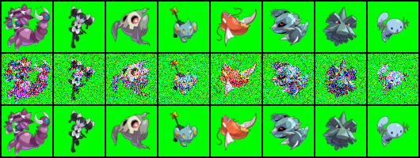
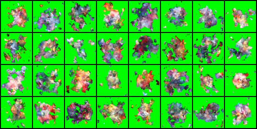

# pokemon-autoencoder
 This repo contains some experiments with a Denoising Autoencoder (AE) Neural Network on a dataset of images of Pokemon that were conducted as part of a course in Machine Learning. Please refer to the documents in the root to learn more about the assignment specifications. We explored architectures with varying numbers of layers, convolution kernel sizes, size of the latent representation and final activation functions. The best results were achieved with the network specified in models.py, which has 5 layers in each of the Encoder and Decoder and was trained for 10,000 epochs. 
 
In the image below, the first row shows a corrupted image which is input into the Autoencoder, the second row shows the uncorrupted image (for our personal reference) and the third row shows the output of the Autoencoder. The network is able to successfully recover many details of the original image, with the most noticeable fault being its inconsistency in recovering fine lines such as tails of the Pokemon. 

The following image shows the output of the network when given random noise as input. In a loose sense, this represents the networks attempt at returning an image of a pokemon similar to the random input. At a glance they do appear to have some resemblance to a pokemon, although a closer inspection reveals them to be mostly colourful blobs. To make these generated pokemon appear more to our expectations, we could model the distribution of the original pokemon data set and give inputs which are sampled from this distribution (instead of simply giving random noise as inputs).

